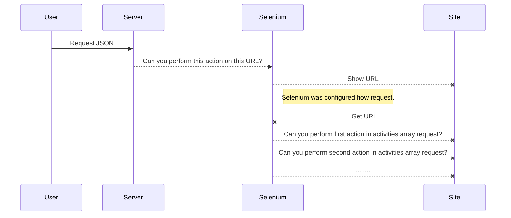

# Selenium API

It's Selenium API, you can test simple call one API, for all end-2-end test case only deploying on your server API. 
**IMPORTANT**. If you want to deploy on cloud you must configure properly selenium as well browser driver.
I realize a proof of concept for Chrome on AWS Ec2. It's work like a charm!

# Requirements
REST API /test accept json request for simulate user UI action:
 - click on anchor and button
 - insert text in texbox
 - perform some check existing text in specific DOM element
 - check if exist specific DOM element that will be recognize from css selector

Request will be validate by check if exist all required input and css selector find minimum one DOM element.
If there are some validation error that will be showed in response.
 

## **Technical requirement**
Spring Boot application expose REST API /test accept request for run headless Selenium instance.

### API: GET /test
Request is formed by:

 - **Url**: is url to start test case
 - **Configuration**: some extra configuration 
	 - **useJQuery**: Inject JQuery script
	 - **makeSnapshot**: make Snapshot
	 - **headless**: Enable headless mode (enable that for server mode)
	 - **remoteDebuggingPort**: could be necessary in some case for ec2 instance
	 - **browserVersion**: you can define which version browser is installed on system environment.
	 - **driverVersion**: you can define which version driver is installed on system environment.
	 - **enableThirdPartyCookies**: you can define true, if you want enable third Party cookies management browser
	 - **userAgent**: you can customize userAgent
	 - **singleProcess**: you can add option
	 - **extraConfiguration**: you can add extra options will be add (all options must be separate ; symbol)
	 
 - **Activities**: Actions will be performed sequentially. Think about: if you click on ahref, the page changed url and there are some DOM element different then you check if exist element and click on it after.
 Change order action executing change result, so make sure ordering actions are the same you performe like user. 

JSON request to API running different actions: before click on button with redirection to new page, after fill form and insert values submitted.
After check if exist "OK" phrase in the page for checking if exist the address we find.

    {  "url": "https://www.eolo.it/home/casa/eolo/eolo-piu.html",
	  "configuration":{
		"useJQuery":false,
		"makeSnapshot":true,
		"headless":true,
		"remoteDebuggingPort":false,
		"driverVersion":"104.0.5112.20",
		"browserVersion":"104.0.5112.79",
		"userAgent":"Mozilla/5.0 (Windows NT 10.0; Win64; x64) AppleWebKit/537.36 (KHTML, like Gecko) Chrome/99.0.4844.51 Safari/537.36."
	  },
	  "activities": [
	    {
	      "type": "Click",
	      "elementHtml": {
		  "selector":{
		    "cssSelector": ".eolo-offerta-rectangle a.eolo-orange-button"
		  }

	      }
	    },
	    {
	      "type": "InsertText",
	      "textToInsert":"Varese",
	      "elementHtml": {
		  "selector":{
		    "cssSelector": ".form-field.field-example #city_label"
		  }  
	      }
	    },
	    {
	      "type": "Click",
	      "elementHtml": {
		  "selector":{
		    "cssSelector": "#ui-id-1 .ui-menu-item"
		  }
	      }
	    },
	    {
	      "type": "InsertText",
	      "textToInsert":"Via Gaspare Gozzi",
	      "elementHtml": {
		  "selector":{
		    "cssSelector": ".form-field.field-example #address"
		  }  
	      }
	    },
	    {
	      "type": "Click",
	      "elementHtml": {
		  "selector":{
		    "cssSelector": "#ui-id-5 .ui-menu-item"
		  }

	      }
	    },
	    {
	      "type": "InsertText",
	      "textToInsert":"1",
	      "elementHtml": {
		  "selector":{
		    "cssSelector": ".form-field.field-example #number"
		  }  
	      }
	    },
	    {
	      "type": "Click",
	      "elementHtml": {
		  "selector":{
		    "cssSelector": ".eolo-orange-button.check-coverage-box--check-coverage-btn.js-aidTarget"
		  }
	      }
	    },
	    {
	      "type": "Exist",
	      "elementHtml": {
		  "selector":{
		    "cssSelector": ".new-funnel-2021--address-content-info img[src*='bollino-fibra']"
		  }
	      }
	    },
	    {
	      "type": "ExistText",
	      "text": "La tua zona è coperta!",
	      "elementHtml": {
		  "selector":{
		    "cssSelector": ".new-funnel-2021--configuration.new-funnel-2021--questions h1"
		  }
	      }
	    }
	    ]
	}


## UML diagrams
What's do it succed when you hit on REST API?
We discuss about parts are envolved when you running one test.

When you send request you must define this elements:

```mermaid
erDiagram  
 Element ||--|{  Activity  : uses
 Element ||--|{  Url  : uses
 Element ||--|{  type  : uses
 Activity||--o{  Click  : heritage
 Activity||--o{  ExistText  : heritage
 Activity||--o{  Exist  : heritage
 Activity||--o{  InsertText  : heritage
 Element ||--|{  Configuration  : uses
 ```
## Actions performed

All actions extends Activity class and was distinguee by type field.
 

## Configuration Ec2 Amazon Linux
If you want Selenium API in Ec2 Aws you must install Chromium and Chrome Browser for permit to selenium running Chrome instance.
Actually we must install version major than 104, because selenium driver dependency manage only 104 or major.
It necessary to install properly **Chrome Driver** 

    wget https://chromedriver.storage.googleapis.com/104.0.5112.20/chromedriver_linux64.zip
    sudo unzip chromedriver_linux64.zip
    sudo mv chromedriver /usr/bin/chromedriver
    chromedriver --version

For the **Google Chrome** to work we also need to install Google Chrome.

    curl https://intoli.com/install-google-chrome.sh | bash 
    sudo mv /usr/bin/google-chrome-stable /usr/bin/google-chrome 
    google-chrome --version && which google-chrome

In general can be useful install chromium browser but it depend to kernel and server you choose:

    sudo yum install chromium browser
    sudo amazon-linux-extras install epel -y
    sudo yum install -y chromium
    chromium -version

### Troubleshooting
If you have this error when you try to run spring boot application:

    The JAVA_HOME environment variable is not defined correctly, this environment variable is needed to run this program.

If you have correct Java and Maven configuration try to refresh it with

    source /etc/profile.d/maven.sh

### Run application
Application can be simple runned with 

    cd /home/ec2-user/actions-runner/_work/PROJECT_NAME
    mvn spring-boot:run
  Where PROJECT_NAME is correct directory which project is saved.
  You can run in different way standalone application, java application etc.
  

### Error in response API
If you have some error in response API link to Selenium, could be a version mismatching from **version environment** and **version software** setup (java code).
Version driver can work with different version browser, for example:
 
    "driverVersion":"104.0.5112.20" 
   works correctly with

	 "browserVersion":"104.0.5112.79"

 (on environment we have driver version **104.0.5112.20** and browser version **104.0.5112.79** so we setup in api this configuration).
But occasionally auto update browser on environment can require changes in request API regarding driverVersion and browserVersion.
Actually API implements Selenium for Chromium so we refer this browser.

To stop Chrome browser auto-updating, take one of the following actions:

-   Create an empty repository before installing Chrome browser:  
    `$ sudo touch /etc/default/google-chrome`
-   Add the following line to  **/etc/default/google-chrome**:  
    `repo_add_once=false`

## Future improvement

 1. Design a microservices architecture can improve reliability and
    number of request management with more microservice API back to 		one Gateway API hide complexity.
 2. Uploading batch on s3 bucket all snapshot for consulting necessary
 3. Dashboard with all request api and result (SUCCESS or FAILURE)
 4. Implements Kafka integration for asynchrous batch and use Kafka streams for stats real time. Could be consumed for showing on dashboard.
 5. Use Spring Batch for plan testing in specific time (example in hour when environment not be so loaded).
## Documentation API

Documentation REST API is automagically with Swagger library.
If you go at ./swagger-ui/index.html you can dinamically see request and response API structure.

